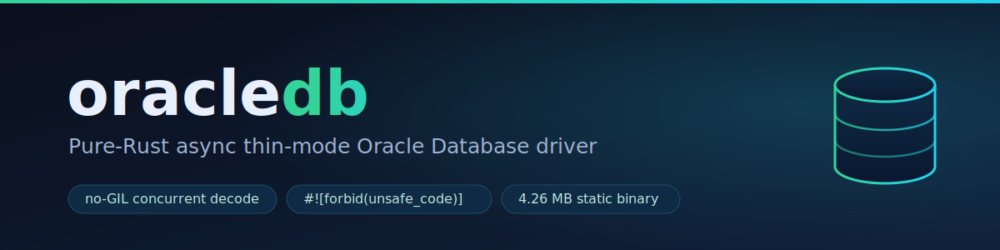

<p align="center">
  
</p>

<p align="center">
  <a href="#license"></a>
  <a href="https://crates.io/crates/oracledb"></a>
  <a href="https://www.rust-lang.org"></a>
  <a href="#robustness"></a>
</p>

**A pure-Rust, async, thin-mode Oracle Database driver. A clean-room port of
python-oracledb v4.0.1 thin mode that passes the reference's own test suite, with
no Oracle Instant Client, no OCI, and no C library at runtime.**

`rust-oracledb` speaks the Oracle TNS/TTC wire protocol directly over TCP. You
add the crate, point it at a listener, and connect; no Instant Client to
install, no shared libraries to ship. It is a faithful re-implementation of the
python-oracledb thin client, so its behaviour tracks that reference, verified by
running python-oracledb's **own** thin-mode test suite against the Rust engine.

> This is an independent project and is not affiliated with Oracle. "Oracle" and
> "python-oracledb" are referenced here only to describe what this driver is
> compatible with.

---

## TL;DR

**The problem.** The Oracle client landscape forces a trade-off. The thick
drivers (OCI / Instant Client, and the Rust `rust-oracle` crate that binds to
ODPI-C) pull in hundreds of megabytes of native libraries you must install and
version-match at runtime. python-oracledb's pure-Python thin mode avoids that,
but it runs the wire codec in Python under the GIL and ships an interpreter.

**The solution.** A thin-mode driver written entirely in Rust. It implements the
TNS/TTC protocol itself, so an application using it compiles to a single static
binary, decodes the wire in parallel across cores (no GIL), fails closed against
hostile input (fuzzed), and maps rows into compile-checked Rust types.

**Verified against the reference's own tests.** rust-oracledb implements the
Oracle TNS/TTC protocol faithfully enough to pass python-oracledb's **own**
thin-mode pytest suite — the very suite the reference driver runs against itself —
in thin mode against Oracle Database 23ai Free. Every claim in this README is
backed by that evidence:

| | result | evidence |
|---|---|---|
| Reference thin-mode tests passing through the Rust engine | **2462** | [docs/PARITY_SKIPS.md](docs/PARITY_SKIPS.md) |
| Skipped (identical node IDs to the reference thin driver) | **116** | every skip proven legitimate — see below |
| Skips that hide a Rust-engine defect | **0** | Rust passes all 303 non-skip tests in the skip-bearing modules |
| Regressions vs the recorded baseline | **0** | [docs/RELEASE_CERTIFICATION.md](docs/RELEASE_CERTIFICATION.md) |

Every one of the 116 skips is forced by the thin-mode contract, not by a
shortcoming in this engine: 88 are `requires thick mode` (the reference thin
driver skips them too), 17 are external/OS authentication (**disproven as ours**:
the reference thin driver *fails* all 17 when the gate is removed, because
bequeath auth is thick-only), 4 are a deliberately inverted older-client vector
check, and 7 are hardcoded upstream `@pytest.mark.skip` markers. The full
node-ID taxonomy and the disproof experiment are in
[docs/PARITY_SKIPS.md](docs/PARITY_SKIPS.md).

The green is real, not fabricated: it was adversarially audited (dead-port
offline falsification, `strace` raw-socket capture of server-computed values).
See [docs/FAKE_PARITY_AUDIT.md](docs/FAKE_PARITY_AUDIT.md).

---

## Why use it

| | rust-oracledb | python-oracledb thin | the edge |
|---|---|---|---|
| **Concurrent decode** | GIL-free; N connections decode on N cores | wire codec runs under the CPython GIL | ~4.4× throughput scaling at 4 workers where Python threads *regress* to ~0.65× (measured — see [Performance](#performance)) |
| **Typed rows** | `#[derive(FromRow)]`, compile-checked field types | dynamic Python objects | type errors at compile time, not at row 10,000 |
| **Errors & binds** | structured `Error` (`.ora_code()`, `.is_retryable()`), `FromSql`/`ToSql`, `params!` | bare `.code` int, manual conversion | a curated transient/connection-lost code set ships built in |
| **Deployment** | one 4.26 MB static musl binary, `FROM scratch` image | interpreter + stdlib + wheel (~151 MB deploy) | ~35× smaller image — python-impossible ([docs/DEPLOYMENT.md](docs/DEPLOYMENT.md)) |
| **Connect strings** | full TNS / tnsnames.ora / EZConnect-Plus parser with byte-offset caret diagnostics | terse `DPY-4017` | points the caret at the offending token ([docs/CONNECT_STRINGS.md](docs/CONNECT_STRINGS.md)) |
| **Offline bug repro** | deterministic `.tns-cassette` record/replay (no DB) | no transport seam | a wire bug travels in one self-contained file ([docs/RECORD_REPLAY.md](docs/RECORD_REPLAY.md)) |
| **Observability** | feature-gated `tracing`/OpenTelemetry spans, GIL-free, zero-cost off | GIL-bound instrumentation | N connections trace in parallel; zero dependency when off ([docs/OBSERVABILITY.md](docs/OBSERVABILITY.md)) |
| **SODA** | experimental thin-mode SODA (42 reference SODA tests pass) | none (SODA is thick-only) | the first pure-thin SODA in an Oracle driver ([docs/SODA.md](docs/SODA.md)) |
| **Safety** | `#![forbid(unsafe_code)]`, fuzzed, OOM-closed by construction | C extension surface | one audited FFI module, quarantined to the test harness ([docs/SAFETY_AUDIT.md](docs/SAFETY_AUDIT.md)) |

Each of these is detailed in [The ledger](#the-better-than-python-oracledb-ledger).

---

## Quick example

```rust
use oracledb::{BlockingConnection, ConnectOptions, FromRow};
use oracledb::protocol::ClientIdentity;

#[derive(FromRow)]
struct Emp {
    id: i64,
    name: String,
    manager_id: Option<i64>, // nullable column -> Option
}

fn main() -> Result<(), oracledb::Error> {
    // The session identity the database records in v$session. Unlike an OCI
    // client (which reports the host process and OS user it runs as), the
    // caller chooses these exactly.
    let identity = ClientIdentity::new(
        "billing-worker", // program
        "edge-pod-7",     // machine
        "tenant-42",      // osuser
        "shard-a",        // terminal
        "rust-oracledb",  // driver name
    )?;

    let options = ConnectOptions::new(
        "dbhost:1521/FREEPDB1", // EasyConnect string
        "app_user",
        "app_password",
        identity,
    );

    let mut conn = BlockingConnection::connect(options)?;

    // Bind typed Rust values positionally (:1, :2, ...) and map rows into a struct.
    let emps: Vec<Emp> = BlockingConnection::query(
        &mut conn,
        "select id, name, manager_id from emp where dept = :1",
        (40,),
    )?
    .into_typed()?;
    for e in &emps {
        println!("{}: {} (mgr {:?})", e.id, e.name, e.manager_id);
    }

    BlockingConnection::close(conn)?;
    Ok(())
}
```

That uses the synchronous [`BlockingConnection`] facade, so it is an ordinary
`main()` with no visible runtime. The async API is identical minus the blocking
wrapper; see [Quickstart](#quickstart).

---

## Performance

**Where Rust wins by a large margin — and where it can't.** rust-oracledb's
advantage is in *throughput, concurrency, and scale* — exactly where a driver's
performance actually matters to an application — and it *widens* under load and
real network latency. On a single tiny network-bound call it ties python-oracledb,
because that call is almost entirely a server round-trip and no driver in any
language can out-compute a round-trip. Both of those are below, measured, with the
honest framing each deserves.

**The mental model (Amdahl, plainly).** A database query is roughly **95% network
+ server round-trip** — identical for every client, and unbeatable — and **~5%
client CPU**. Even a large speedup on that 5% is only a few percent off the whole,
which is invisible on one small query. And the gap on that slice is *modest* to
begin with: python-oracledb's decoder is compiled **Cython**, not pure Python, so
single-threaded it is genuinely competitive — we measure ~1.2× below, not 50×.
This is not a Rust limit; it is physics. *No* driver, in any language, out-computes
a server round-trip. The Rust win appears, and grows, exactly where the
client-CPU fraction does: when **many connections decode at once** (no GIL kills
Python here), or when **one query returns a lot of rows**. Those are the numbers to
lead with.

All numbers below are measured; the methodology, host details, and the raw
per-pass spread are in [docs/PERFORMANCE.md](docs/PERFORMANCE.md). Both drivers
speak the same protocol to the same Oracle 23ai Free container over the same
loopback TCP socket, thin mode on both sides, no Instant Client anywhere.

### The large-margin win: concurrent throughput (the no-GIL result)

This is the headline. A decode-bound workload: N workers each drive their own
connection, repeatedly scanning a warmed 1000-row × 20-column table and decoding
every cell (NUMBER base-100 mantissa parsing + UTF-8 VARCHAR2 builds). Per-side
scaling factor is throughput(N) / throughput(1). Three-pass medians on a shared,
busy host (run-to-run spread noted in [docs/PERFORMANCE.md](docs/PERFORMANCE.md)):

| workers | rust (threads) | python (threads) | python (asyncio) |
|--------:|---------------:|-----------------:|-----------------:|
| 1 | 245k rows/s (1.0×) | 188k (1.0×) | 176k (1.0×) |
| 2 | 522k (2.1×) | 240k (1.3×) | 207k (1.2×) |
| 4 | **1,065k (4.4×)** | 122k (**0.65×**) | 218k (1.2×) |
| 8 | 895k (3.7×) | 111k (0.6×) | 203k (1.2×) |
| 16 | 702k (2.9×) | 115k (0.6×) | 204k (1.2×) |

Rust scales super-linearly through N=2 and peaks near **1.07M rows/s at 4
workers** — then the *single free-tier container*, not the driver, caps it (a
no-GIL multi-process probe hit the same ceiling). python-oracledb threads show the
textbook GIL signature: throughput peaks at 2 workers and then falls *below*
serial — adding threads to a CPU-bound decode only adds GIL hand-off, so more
workers make it **slower**. asyncio hides connection wait but the decode still runs
single-threaded under the GIL, so it plateaus near 1.2×. **At 4 workers Rust's
aggregate is ~8.7× the Python-threads aggregate and ~4.9× asyncio.**

The cap is the test database, not the driver, so this is a *conservative* read: a
larger or clustered DB raises the ceiling and lets Rust's parallel decode keep
climbing while the GIL holds both Python models flat. And it is a *loopback* read:
on a real network the per-fetch read-wait grows, which gives Rust's workers more
of each other's wait to overlap their decode against, while doing nothing for the
single GIL-bound Python decode thread — so real latency *widens* this margin.
(Latency was not injected here; `tc netem` needs root and would corrupt other
tenants on this shared host. The direction is reasoned, not a fabricated number —
see [docs/PERFORMANCE.md](docs/PERFORMANCE.md).)

### The large-margin win: per-thread decode throughput (the language win)

The concurrency win above is real, but you might ask whether it is "just more
cores." It is not: Rust also decodes faster on **one** thread. Single connection,
one large paged fetch of 300k rows × 5 mixed columns (2 NUMBER, 2 VARCHAR2, 1
DATE), measuring rows decoded per second on the client — no concurrency, no GIL
hand-off on either side, byte-identical SQL. Three runs of five passes each,
medians:

| | rust-oracledb | python-oracledb thin | ratio |
|---|---:|---:|---:|
| decode throughput | **~329k rows/s** | ~276k rows/s | **~1.2×** (best-case ~1.26×) |

A real but **modest** single-threaded win. Rust decodes NUMBER into an inline
`{ i128, scale }` (no per-cell heap allocation in the common case), VARCHAR2 into
a `String`/`&str`, and DATE into inline fields, where python-oracledb materializes
a Python `int`/`Decimal`/`str`/`datetime` object **per cell**. That object-per-cell
cost is what Rust skips — and it is the same design that, run on every core at
once with no GIL, produces the large concurrent margin above. (On loopback, part
of each pass is still the round-trips both drivers pay equally, which caps how
large a *single-thread* ratio can get; the leverage is in parallelism.)

### Decode-path tuning

The decode CPU those numbers ride on is profiled and tightened continually — every
change byte-identical to the reference and proven on a microbench before it ships
(and reverted if it doesn't measure: two recent candidates were dropped for failing
to beat the baseline):

- **NUMBER decode +14–38%** — the i128 coefficient is accumulated in a single digit
  walk instead of two.
- **Single-packet responses 1.4–5.2×** — a one-packet fetch reply skips a whole
  buffer copy.
- **`simdutf8`** (feature `simd-decode`, opt-in) — SIMD UTF-8 validation for wide
  text (10.6× on multibyte `VARCHAR2(2000)`; no win on short ASCII, hence off by
  default).

### Pipelining (round-trip elimination, GIL-free)

A batch of N independent statements executes natively in **one** round trip instead
of N — and on the GIL-free engine, so concurrent batches don't serialise. The win is
pure round-trip elimination (it does not speed a single statement) and **grows with
network latency**; on loopback a 10-statement batch already collapses 10 round trips
to 1.

### Borrowed (zero-copy) fetch path

A `for_each_row_ref` fast path lets a Rust consumer iterate rows as borrowed
`QueryValueRef` slices instead of materialising a `String`/`Vec<u8>` per scalar
cell. Measured on a 5000-row × 4-column batch with an allocation counter:

| | owned `fetch_rows` | borrowed `for_each_row_ref` |
|---|---|---|
| allocations/row | 11.00 | 1.01 (**−91%**) |
| wall time | ~15 ms | ~9 ms (**~37% faster**) |
| bytes allocated | baseline | −21% |

### Columnar decode straight into Arrow

With the `arrow` feature, `fetch_all_record_batch_columnar` decodes a fetched
batch directly into per-column Arrow builders — NUMBER → `Decimal128` (straight
from the inline i128 coefficient + scale), VARCHAR/RAW → offset buffers, dates →
Arrow temporal, NULLs → a `NullBuffer` — skipping per-row `QueryValue`
materialisation and the transpose pass entirely. Verified byte-identical to the
row path (synthetic + a live 12 000-row mixed-type fetch). On a 5000 × 10
analytics batch:

| | row → `RecordBatch` | columnar |
|---|---|---|
| allocations/row | 21.99 | 1.03 (**−95%**) |
| bytes allocated | baseline | **−27%** |
| decode + build | 5.85 ms | 4.29 ms |

This is where the no-GIL, no-per-cell-`String` design compounds: an analytics scan
that Python decodes one GIL-bound object at a time, rust-oracledb streams straight
into Arrow columns.

### Pipelined fetch (speculative next-page prefetch)

`for_each_row_ref` issues page *K+1*'s fetch round-trip **before** decoding page
*K*, so the server processes the next page and the kernel buffers its bytes while
the client is still decoding the current one — overlapping wire I/O with decode
on a single connection (something the CPython GIL structurally prevents). Bounded
to one page of look-ahead, and cancellation-safe: a drop mid-prefetch leaves the
stranded page to be broken-and-drained by the next operation (proven by a
deterministic test with a negative control), and the prefetched rows are
byte-identical to the serial path.

| metric (50k rows, arraysize 1000, ~49 pages) | result |
|---|---|
| per-page read-wait | **−5.6% to −24%** (the robust signal) |
| wall time, realistic per-row consumer | **−12.5% to −19.5%** |
| wall time, trivial consumer (loopback) | break-even to −6% |

**Note:** on loopback the hideable read latency is tiny (~300 µs), so a
trivial consumer is ~break-even; the win is dominated by network RTT, so it grows
on real networks — loopback is the *conservative floor*, not the headline.

### The honest tie: serial single-call operations

A single tiny network-bound call — `select 1 from dual`, a one-row fetch, a small
CLOB read — **ties**, and that is the correct result, not a weakness. By the
mental model above, such a call is almost entirely the server round-trip both
drivers wait on identically; the client-CPU slice Rust optimizes is a rounding
error on the total. This is the operation *least* able to reveal any client's
speed: there is barely any client work in it to be fast *at*. python-oracledb's
decade-tuned Cython sometimes edges ahead by tens of microseconds on the very
cheapest calls, and at application scale that gap is negligible — and it inverts
the moment the workload is concurrent or decode-heavy (the two large-margin
sections above).

Single connection, serial calls, warm caches. Below ~200 µs the host jitter
dominates; treat one-significant-figure differences as ties.

| operation | rust-oracledb | python-oracledb thin | note |
|---|---|---|---|
| `connect` (full handshake) | 32.6 ms | 33.3 ms | tie — network/server-bound; the floor for both |
| `select 1 from dual` | ~123 µs (after opt) | ~80 µs | round-trip-bound; the op least able to show client speed |
| fetch 10k rows | 5.0 ms | 4.7 ms | tie — wire-serialization bound |
| executemany 1000 | 2.2 ms | 2.0 ms | tie (both bimodal under host contention) |
| CLOB read 64 KiB | ~768 µs (after opt) | ~440 µs | small + round-trip-bound; Rust improved −17% via single-pass UTF-16 decode |

Those client-CPU paths were profiled and tightened anyway, even though the serial
gap is negligible: a per-call runtime cache (−59% to −62% on the blocking facade),
a single-pass UTF-16 LOB decoder (−50% on decode), and execute-payload
preallocation (−18% allocations/call). Full optimization history in
[docs/PERFORMANCE.md](docs/PERFORMANCE.md#optimization-history).

**Measurement notes:** these are loopback, single-host, plain-TCP
measurements on a *shared, busy* AMD EPYC box (`schedutil` governor, cores not
pinned), so sub-200 µs numbers carry real run-to-run variance. A real network
with TLS would add latency equally to both drivers and push every serial
operation further toward "network-dominated, therefore a tie". The thick
`rust-oracle` crate is deliberately not benchmarked: it requires Instant Client,
which this project avoids by design.

### The takeaway

rust-oracledb's performance advantage is in **throughput, concurrency, and
scale** — exactly where a driver's performance matters to a real application —
and it **widens with load and real network latency**. Single tiny round-trip
calls tie, because they are almost all round-trip and no client can beat the
server's clock. Pick the driver for the shape of *your* workload: if it is
concurrent or decode-heavy, the margin is large and measured above.

---

## The better-than-python-oracledb ledger

Each row is a concrete differentiator, with the specific edge.

| feature | rust-oracledb | python-oracledb thin | the edge |
|---|---|---|---|
| **No-GIL concurrent decode** | every connection decodes on its own OS thread, sharing nothing | wire codec holds the CPython GIL | true multicore decode: ~4.4× scaling at N=4 vs python-threads' ~0.65× *regression* ([docs/PERFORMANCE.md](docs/PERFORMANCE.md)) |
| **Compile-checked rows** | `#[derive(FromRow)]` maps a row into a struct with typed fields; `Option<T>` = nullable | runtime Python objects | type mismatches are compile errors |
| **Structured errors + binds** | `Error::ora_code()`, `is_retryable()`, `is_connection_lost()`; `FromSql`/`ToSql`/`params!`; lossless `Decimal` ↔ NUMBER | bare `.code` int, manual conversion | curated transient + connection-lost code sets ship built in |
| **Single static binary** | 4.26 MB stripped musl binary, `FROM scratch` image (one layer, one file) | interpreter + stdlib + wheel | ~35× smaller than python's ~151 MB thin deploy — and python-impossible ([docs/DEPLOYMENT.md](docs/DEPLOYMENT.md)) |
| **Connect-string parser** | full TNS descriptor / tnsnames.ora (+`IFILE`) / EZConnect-Plus, with offset-pointed caret diagnostics | terse `DPY-4017` | a malformed descriptor points the caret at the offending token ([docs/CONNECT_STRINGS.md](docs/CONNECT_STRINGS.md)) |
| **Record/replay** | deterministic `.tns-cassette` capture + offline replay with no socket | no transport seam | reproduce a production wire bug from one file, no DB ([docs/RECORD_REPLAY.md](docs/RECORD_REPLAY.md)) |
| **Observability** | feature-gated `tracing`/OpenTelemetry per-round-trip spans, GIL-free, digest-only (no secrets), zero-cost off | GIL-bound, app-wired | N connections trace in parallel; the dependency isn't compiled in when off ([docs/OBSERVABILITY.md](docs/OBSERVABILITY.md)) |
| **Thin-mode SODA** (experimental) | SODA over the thin TTC protocol — 42 of Oracle's own SODA tests pass | raises `DPI-1050`; SODA is thick-only | the first pure-thin SODA in an Oracle driver ([docs/SODA.md](docs/SODA.md)) |
| **Fail-closed decoder** | OOM-closed by construction (`BoundedReader`); 20 cargo-fuzz targets, billions of execs, 0 crashes | — | a hostile/buggy server cannot OOM or panic the client ([docs/FUZZING.md](docs/FUZZING.md)) |
| **Cancellation-correct fetch** | `cancel()` / scope cancel-on-drop sends a break and drains, leaving a clean connection | — | a cancelled or timed-out fetch never poisons a reused connection |

---

## Robustness

The protocol crate is `#![forbid(unsafe_code)]`, as is the async driver crate.
The only `unsafe` in the entire workspace is one audited module
(`arrow_capsule.rs`, the Arrow C Data Interface PyCapsule export) that lives in
the **PyO3 test harness**, not in either published crate. Every site is
FFI-inherent and reviewed sound ([docs/SAFETY_AUDIT.md](docs/SAFETY_AUDIT.md)).

Every untrusted input path is **fail-closed**: the wire decoder, the TLS wallet
readers, and the connect-string parser return a structured error on malformed or
hostile input — never a panic, OOM, or stack overflow.

The wire decoder is **coverage-guided fuzzed** with 20 cargo-fuzz targets across
the untrusted decode boundaries (packet framing, auth/accept/query/borrowed-query
responses, OSON, VECTOR, scalar codecs, server-error trailer, direct-path, AQ,
CQN/subscription, LOB, DbObject, OAC, sessionless TPC, wallet parsers) plus the
connect-string parser. Bounded sessions log billions of executions under
ASan/UBSan with overflow-checks and **zero crashes**. The entire
OOM-from-wire-length class is **closed by construction** via the `BoundedReader`
invariant: an allocation can never exceed the bytes remaining in the message
buffer. A **differential fuzz oracle** additionally cross-checks the decoder
against python-oracledb's own decoder on identical wire bytes — 0 divergences
across thousands of generated values. See [docs/FUZZING.md](docs/FUZZING.md).

---

## Installation

`rust-oracledb` requires **nightly Rust** (its async runtime, asupersync, is built
with `#![feature(try_trait_v2)]`) and is published on crates.io as
[`oracledb`](https://crates.io/crates/oracledb). The active pin and re-pin
procedure are documented in [docs/TOOLCHAIN.md](docs/TOOLCHAIN.md):

```bash
cargo add oracledb
```

```toml
[dependencies]
oracledb = "0.8"
# optional features: arrow, chrono, uuid, serde_json, rust_decimal, tracing, cassette, soda, experimental
```

### Single static binary (`FROM scratch`)

Because the driver links no native Oracle library, an application can be built as
one fully-static musl binary and shipped in an empty image:

```bash
rustup target add x86_64-unknown-linux-musl
cargo build --release -p oracledb --target x86_64-unknown-linux-musl
```

The end-to-end recipe (musl C toolchain for `ring`, `FROM scratch` Dockerfile,
and the measured 4.26 MB result) is in [docs/DEPLOYMENT.md](docs/DEPLOYMENT.md).

---

## Quickstart

### Synchronous (blocking facade)

See [Quick example](#quick-example) above. `BlockingConnection` wraps the async
driver in a per-thread runtime, so it is an ordinary `main()`.

### Async

The async API mirrors the blocking one; every method takes an asupersync `&Cx`:

```rust
use asupersync::runtime::RuntimeBuilder;
use asupersync::Cx;
use oracledb::{Connection, ConnectOptions};
use oracledb::protocol::ClientIdentity;

fn main() -> Result<(), Box<dyn std::error::Error>> {
    let runtime = RuntimeBuilder::current_thread().build()?;
    runtime.block_on(async {
        let cx = Cx::current().expect("Runtime::block_on installs an ambient Cx");

        let identity = ClientIdentity::new(
            "billing-worker", "edge-pod-7", "tenant-42", "shard-a", "rust-oracledb",
        )?;
        let options = ConnectOptions::new(
            "dbhost:1521/FREEPDB1", "app_user", "app_password", identity,
        );

        let mut conn = Connection::connect(&cx, options).await?;
        // `query_one` enforces exactly one row and hands back a `Row`.
        let sum: i64 = conn.query_one(&cx, "select 7 + 5 from dual", ()).await?.get(0)?;
        assert_eq!(sum, 12);
        conn.close(&cx).await?;
        Ok::<_, oracledb::Error>(())
    })?;
    Ok(())
}
```

### Binds and named parameters

```rust
use oracledb::params;

// Positional: a tuple, a slice, or `params!{...}`. `query` returns a streaming
// `Rows` handle; `collect(&cx)` drains every batch into `Vec<Row>`.
let positional = conn
    .query(&cx, "select :1 + :2 from dual", (40, 2))
    .await?
    .collect(&cx)
    .await?;

// Named: order-independent; placeholder order in the SQL is resolved for you.
// `query_one` enforces exactly one row and hands back a single `Row`.
let row = conn
    .query_one(
        &cx,
        "select id, name from emp where id = :id and name = :name",
        params!{ ":id" => 40, ":name" => "alice" },
    )
    .await?;

// Pull typed cells out of a `Row` by index or by (case-insensitive) column name.
let id: i64 = row.get(0)?;
let name: String = row.get("name")?;
```

### Typed rows with `#[derive(FromRow)]`

```rust
use oracledb::FromRow;

#[derive(FromRow)]
struct Emp {
    id: i64,
    name: String,
    hired: Option<String>, // NULL -> None; a non-Option NULL is a hard error
}

// `into_typed(&cx).await` drains every batch and maps each row through FromRow.
let emps: Vec<Emp> = conn
    .query(&cx, "select id, name, hired from emp", ())
    .await?
    .into_typed(&cx)
    .await?;
```

> The blocking facade has the all-rows shortcut `BlockingConnection::query(...)?.into_typed::<Emp>()`,
> which collects every batch and maps it in one call (used in the [Quick example](#quick-example)).
> Async `Rows` has the matching `.into_typed(&cx).await?` shortcut.

### Feature flags

`default = ["derive"]`. The `derive` proc-macro is build-time-only, so the
default runtime build pulls in nothing extra. The supported feature-profile
matrix is defined in [docs/SUPPORT.md](docs/SUPPORT.md).

| feature | default | what it adds |
|---|:---:|---|
| `derive` | ✅ | `#[derive(FromRow)]` for compile-checked typed rows |
| `chrono` | | `FromSql`/`ToSql` for `chrono` date/time types |
| `uuid` | | `FromSql`/`ToSql` for `uuid::Uuid` |
| `serde_json` | | `FromSql`/`ToSql` for `serde_json::Value` |
| `rust_decimal` | | lossless `rust_decimal::Decimal` ↔ NUMBER |
| `arrow` | | Arrow `RecordBatch` fetch + C Data Interface export |
| `tracing` | | feature-gated OpenTelemetry-style spans (zero-cost off) |
| `cassette` | | `.tns-cassette` transport record/replay seam |
| `soda` | | **experimental** thin-mode SODA |
| `experimental` | | the `cwallet.sso` SSO auto-login wallet reader |

---

## Architecture

Three crates, plus a test-only harness:

```text
oracledb-protocol   sans-I/O TNS/TTC codec. #![forbid(unsafe_code)].
   (codec core)     Decodes everything an untrusted server puts on the wire;
                    every wire-length-driven allocation is BoundedReader-checked.
        │
        ▼
oracledb            async driver on the asupersync runtime, plus the
   (the driver)     BlockingConnection synchronous facade. #![forbid(unsafe_code)].
                    Connection / execute / fetch / LOB / pool / TLS / SODA.
        │
        ▼
oracledb-pyshim     PyO3 module slotted under python-oracledb's public layer so
   (test harness)   the reference's OWN pytest suite drives the Rust engine.
                    The one quarantined `unsafe` (Arrow FFI) lives here, not in
                    the published crates.
```

`oracledb-derive` is the build-time proc-macro crate behind `#[derive(FromRow)]`.

---

## Scope

- **Native ergonomic surfaces.** First-class typed APIs over capabilities
  the engine already speaks: REF CURSOR / implicit result sets
  (`Connection::fetch_cursor`), structured ADT object **and collection** decode
  (`describe_object_type` / `decode_object`), `DBMS_OUTPUT` capture
  (`enable_dbms_output` / `read_dbms_output`), edition selection
  (`ConnectOptions::with_edition`), OCI IAM / OAuth2 token auth
  (`with_access_token`, with a redacted `AccessToken` and a TLS-required guard),
  and compiler-style caret diagnostics for parse errors (`Error::caret`). All
  live-tested against Oracle 23ai.
- **Thin-mode SODA (preview).** rust-oracledb is the first Oracle driver to offer
  SODA in thin mode at all — it already passes 42 of the reference's own SODA
  tests (python-oracledb thin has none). The document API and its current surface
  are in [docs/SODA.md](docs/SODA.md).
- **TLS / TCPS with wallets.** rustls over the async transport, `ewallet.pem`, and
  server-DN matching — implemented and handshake-tested with real crypto. The
  setup guide (wallet formats, standing up a TCPS listener) is in
  [docs/TLS_SETUP.md](docs/TLS_SETUP.md).
- **Single static binary on `x86_64-musl`** for the `FROM scratch` image; the
  crate also builds as an ordinary library on the usual targets.

---

## Testing

```bash
# Unit + golden tests, no database needed:
cargo test --workspace

# With optional features:
cargo test --workspace --features cassette
```

Conformance against python-oracledb's own suite, fuzzing, and the live
container-backed integration tests need a local Oracle container; the harness and
docs ([docs/FUZZING.md](docs/FUZZING.md), [docs/PERFORMANCE.md](docs/PERFORMANCE.md))
give the exact commands. Container-dependent benches and tests self-skip cleanly
when no listener is present.

### Multi-version live matrix (release gate)

The 0.5.x line was only ever live-tested against 23ai FREE — which is exactly
how a connect path that could not reach *any* pre-23ai server shipped. Server-
version coverage is therefore a **standing gate**, not an optional extra:

```bash
# One container per server generation (xe11 / xe18 / xe21 / free23):
scripts/version_matrix.sh up all && scripts/version_matrix.sh health all

# Quick connect smoke per lane:
scripts/version_matrix.sh smoke all

# FULL value-asserting suite per lane (examples/matrix_full.rs): identity,
# multi-packet fetch, wide rows, bind DML + rollback/commit, CLOB/BLOB
# write+readback, describe metadata, NULLs, scalar round-trips, error paths:
scripts/version_matrix.sh full all
```

The `xe11` lane (Oracle 11g) is deliberately **below** the supported protocol
floor (`TNS_VERSION_MIN_ACCEPTED = 315`; 11g negotiates 314): its assertion is
inverted — the lane passes when the driver *refuses* the server with the
structured `UnsupportedVersion` error naming the floor (python-oracledb
DPY-3010 parity), never a hang or a misleading decode error.

**A release cannot ship without a green full-matrix run recorded for the
release SHA.** Run `scripts/release_matrix_gate.sh` on the commit you intend
to tag; it runs `version_matrix.sh full` for every lane and writes
`tests/artifacts/version_matrix/results-<sha>.json`. Commit that file —
`scripts/release_preflight.sh` (executed by the tag-driven release workflow)
rejects any tag whose HEAD has no committed, all-green artifact. CI also runs
the full matrix on every push to `main` touching `crates/**` plus nightly
(`.github/workflows/version-matrix.yml`, gvenzl service containers).

A genuine 19c EE lane (Oracle Container Registry, requires an OTN account;
free for dev/test) is a documented **operator-run pre-release extra**, not
part of the automated gate — XE 18 and XE 21 bracket 19c on the relevant
protocol behaviors (RESEND on connect, classic non-fast-auth session
establishment, no END_OF_RESPONSE framing) and reproduce the original field
failure byte-identically.

---

## Troubleshooting

| symptom | likely cause | fix |
|---|---|---|
| `ORA-12541: TNS:no listener`, or connect refused/timeout | nothing is listening at that `host:port` | start the listener and check the `host:port/service` of your EasyConnect string; for the test container, `scripts/container.sh up` |
| `ORA-12514: ... does not currently know of service` | wrong service name (e.g. a SID, or the CDB instead of the PDB) | use the PDB service name (e.g. `FREEPDB1`); confirm available services with `lsnrctl status` |
| `ORA-01017: invalid username/password` | bad credentials, or proxy/token/external-auth misconfigured | verify the user/password; for IAM/OAuth2 token or wallet auth see [docs/TLS_SETUP.md](docs/TLS_SETUP.md) |
| Build fails with `error[E0658]` / `feature(try_trait_v2)` | building on **stable** Rust | this crate requires nightly — `rustup override set nightly` (the exact pinned toolchain is in [docs/TOOLCHAIN.md](docs/TOOLCHAIN.md)) |
| `ConversionError` "unexpected NULL" while mapping a row | a `NULL` column mapped to a non-`Option` field | make the field `Option<T>` (NULL → `None`); a non-`Option` NULL is a deliberate hard error, not a silent default |
| async `.into_typed()` won't compile / "expected `&Cx`" | async `into_typed` takes `&cx` and is awaited | call `rows.into_typed::<T>(&cx).await?`; the blocking facade's `into_typed()` takes no `cx` |
| TLS/TCPS handshake fails (cert / server-DN) | wallet path, DN match, or SNI | see [docs/TLS_SETUP.md](docs/TLS_SETUP.md); a `cwallet.sso` auto-login wallet needs `--features experimental` |
| a connect string is rejected as malformed | a typo in a TNS descriptor / EZConnect-Plus token | the error carries a **byte-offset caret** pointing at the offending token — read it; full grammar in [docs/CONNECT_STRINGS.md](docs/CONNECT_STRINGS.md) |

### Capturing a connect/handshake trace

When a connection fails in a way the error string alone can't explain, capture
the wire-level handshake. Set **`ORACLEDB_TRACE_CONNECT=1`** and every step of
the connect — plus a hex dump of each TNS packet — is written to **stderr**
(the same detail python-oracledb thin exposes via `PYO_DEBUG_PACKETS`):

```console
$ ORACLEDB_TRACE_CONNECT=1 your-app 2> connect.trace
```

Add **`ORACLEDB_TRACE_QUERY=1`** to also hex-dump statement execute/fetch
payloads (`oracledb::query: ...` lines) once the session is up.

> **`RUST_LOG` does _not_ control this.** The trace is gated on
> `ORACLEDB_TRACE_CONNECT`, independent of the `tracing`/`log` level — a triage
> session running `RUST_LOG=trace` will see *nothing* here. This is a deliberate
> hard switch so the (verbose, packet-level) dump never turns on by accident.

**What a healthy handshake looks like** — transport, `CONNECT`, `ACCEPT`
(carrying the negotiated capabilities), then the two auth phases, then
`session established`:

```text
oracledb::connect: tcp connect
oracledb::connect: tcp connected
oracledb::connect: CONNECT descriptor: (DESCRIPTION=(ADDRESS=(PROTOCOL=tcp)...
oracledb::connect: CONNECT packet len=... hex=00...
oracledb::connect: send CONNECT
oracledb::connect: read ACCEPT
oracledb::connect: ACCEPT sdu=8192 fast_auth=true end_of_response=true oob=true
oracledb::connect: AUTH phase one payload len=... hex=...
oracledb::connect: send AUTH phase one
oracledb::connect: read AUTH phase one
oracledb::connect: AUTH phase two payload len=... hex=...
oracledb::connect: send AUTH phase two
oracledb::connect: read AUTH phase two
oracledb::connect: session established sid=1234 serial=5678
```

Two patterns worth recognising:

- **`RESEND` — server asked to resend the `CONNECT`.** You'll see
  `RESEND requested; resending CONNECT` between the first `send CONNECT` and the
  eventual `read ACCEPT`. One or two is normal (pre-23ai listeners RESEND
  routinely); a storm of them that never reaches `ACCEPT` points at a
  descriptor the listener keeps rejecting.
- **Missing / failed fast-auth — the classic fallback.** Read the `ACCEPT`
  line: `fast_auth=false` means the server did not offer the combined fast-auth
  bundle, so the driver runs the classic path and you'll see
  `send protocol negotiation (classic)` and `send data types (classic)` before
  `AUTH phase one`. If you *expected* fast auth (a 23ai server) but see
  `fast_auth=false`, the negotiation — not your credentials — is the thing to
  investigate.

To pinpoint where a failing connect diverges, capture a **working** exchange and
a **failing** one the same way and `diff` the two step streams — the first line
that differs is where the handshake broke down.

**Traces are safe to share.** Secrets never enter the trace: the password is
O5LOGON-encrypted (`generate_verifier`) into the phase-two verifier *before* any
byte is dumped, and the fast-auth **access token** payload is sent but never
handed to the hex-dumper (only its token-free *response* is). So the hex you see
is the encrypted verifier / negotiation frames, never a plaintext password or
token. This exclusion is pinned by a regression test
(`tests/connect_trace_secret.rs`) and a source lint
(`scripts/check_trace_secret_exclusion.sh`).

---

## FAQ

**Does it need Oracle Instant Client or OCI?** No. It is pure Rust and speaks the
wire protocol directly. That is the entire point.

**How does it relate to python-oracledb?** It is the Rust-native counterpart: the
same Oracle wire protocol, the same behaviour — proven by passing python-oracledb's
own thin-mode test suite — exposed through an idiomatic Rust API (`#[derive(FromRow)]`,
`params!`, structured errors) instead of Python objects.

**Why thin mode only?** Thin mode is what makes the single-static-binary,
no-Instant-Client deployment possible. A thick driver would re-introduce the
native dependency this project exists to avoid.

**What Oracle versions are tested?** Oracle Database 23ai Free (23.26) is the
database under test. The protocol negotiates capabilities and the codecs match
python-oracledb thin's, which targets 12.1+ servers.

**Can I use it synchronously?** Yes. `BlockingConnection` wraps the async driver
in a per-thread runtime, so no async is visible to the caller.

**TLS to Autonomous Database?** The TCPS client path is implemented; you supply a
wallet (`ewallet.pem`, or `cwallet.sso` with `--features experimental`). See
[docs/TLS_SETUP.md](docs/TLS_SETUP.md) for the limitations.

---

## License

Dual-licensed under either of:

- Apache License, Version 2.0 ([LICENSE-APACHE](LICENSE-APACHE))
- MIT license ([LICENSE-MIT](LICENSE-MIT))

at your option.

[`BlockingConnection`]: https://docs.rs/oracledb/latest/oracledb/struct.BlockingConnection.html


---

### Work with me

I help enterprises with the hard parts — databases at scale, systems modernization, and AI in production, vendor-neutral (cloud or self-hosted). Building something hard in databases, Rust / C++, or AI? Reach out.

→ **[durakovic.ai](https://durakovic.ai)** · hello@durakovic.ai
